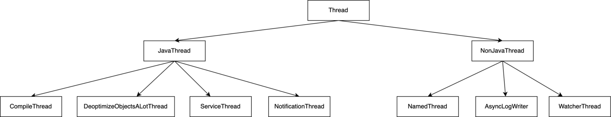

# HotSpot 中的Thread
## Java中的Thread的执行逻辑
Java中的Thread代表JVM中运行的线程，实际在运行过程中会绑定到linux中的pthread，Java在创建Thread的时候并不会直接通过pthread_create创建线程，只有在调用.start()方法的时候才会创建线程，并且通过调用JNI的方式绑定到具体的run()逻辑。
## HotSpot中的Thread逻辑图
在HotSpot中Thread分为多级，具体的继承关系和层级结构

其中NamedThread包括VMThread和GCThread等

JavaThread一般申请为java的应用线程，在java启动一个Thread的时候会调用pthread_create初始化其中的OSThread

Hotspot JVM 主要的后台线程包括：

* VM thread: 这个线程专门用于处理那些需要等待JVM满足safe-point条件的操作。safe-point代表现在没有修改heap的操作发生。这种类型的操作包括：”stop-the-world”类型的GC，thread stack dump，线程挂起，或撤销对象偏向锁(biased locking revocation)
* Periodic task thread: 用于处理周期性事件（如：中断）的线程
* GC threads: JVM中，用于支持不同阶段的GC操作的线程
* Compiler threads: 用于在运行时，将字节码编译为本地代码的线程
* Signal dispatcher thread: 接受发送给JVM处理的信号，并调用对应的JVM方法