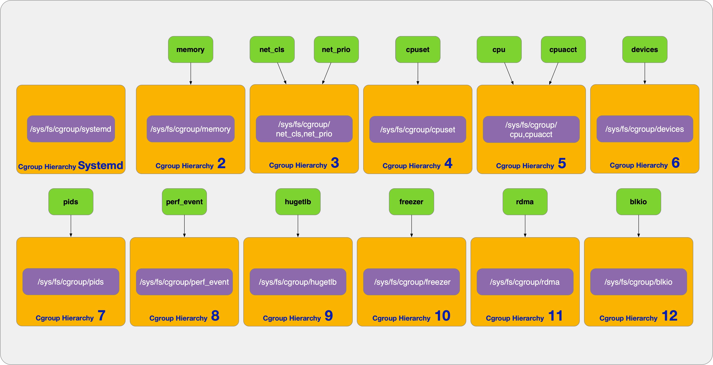
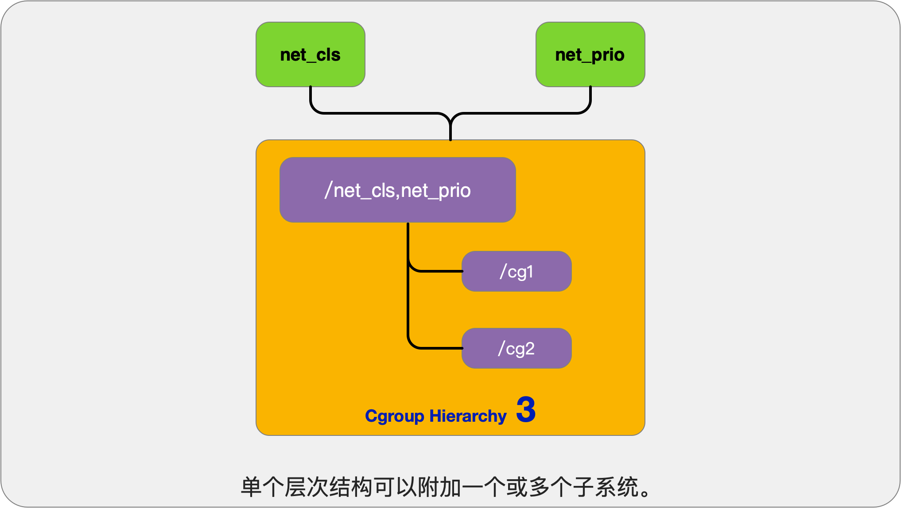
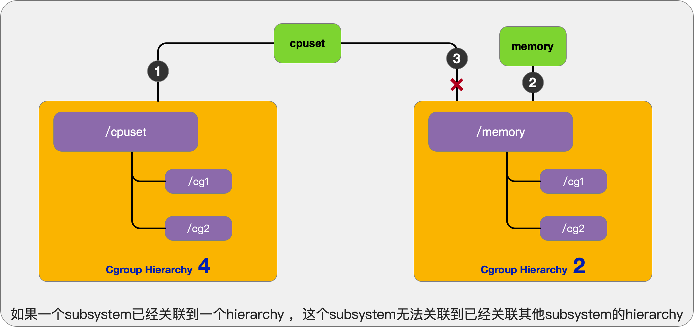
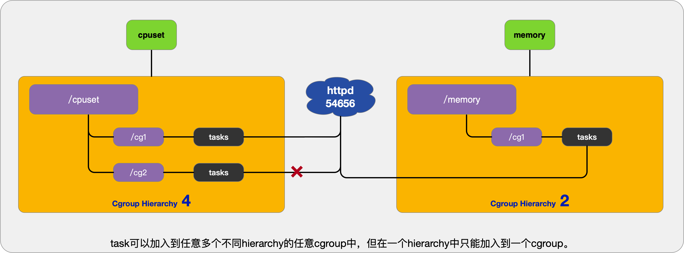
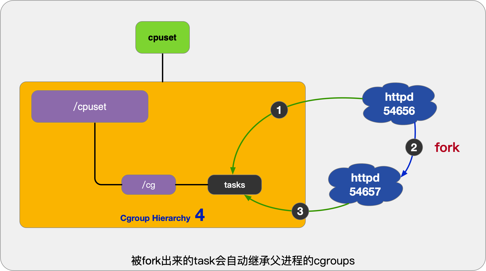
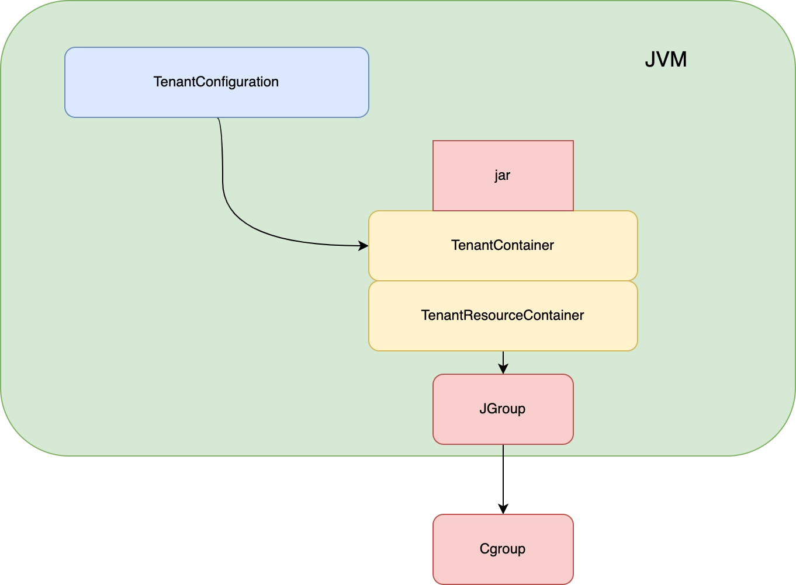

## JVM Tenant介绍 
### Tenant 特性
1. 环境隔离
    * 在tomcat上运行多个jar启动应用程序，同时运行在一个jvm上面，但是独自有各自的环境 
2. 资源限制
    * 通过cgroup设置限制cpu的使用
        * cpu.cfs_period_us和cpu.cfs_quota_us
        * cpuset.cpus
        * cpu.shares

### Cgroup 介绍
~~~shell
#subsys_name    hierarchy       num_cgroups     enabled
cpuset  9       97      1
cpu     3       139     1
cpuacct 3       139     1
memory  8       61      1
devices 6       61      1
freezer 2       4       1
net_cls 5       4       1
blkio   10      61      1
perf_event      7       4       1
hugetlb 4       4       1
pids    11      61      1
net_prio        5       4       1
~~~
1. 子系统
* cpu:用来限制cgroup的CPU使用率。
* memory:统计和限制cgroup的内存的使用率，包括process memory, kernel memory, 和swap。
* cpuset:绑定cgroup到指定CPUs和NUMA节点。
* blkio:限制cgroup访问块设备的IO速度。
* devices:限制cgroup创建(mknod)和访问设备的权限。
* hugtlb:限制cgroup的huge pages的使用量。
* net_cls:将一个cgroup中进程创建的所有网络包加上一个classid标记，用于tc和iptables。 只对发出去的网络包生效，对收到的网络包不起作用。
* net_prio:针对每个网络接口设置cgroup的访问优先级。
* perf_event:对cgroup进行性能监控。
* pid:限制一个cgroup及其子孙cgroup中的总进程数。
2. Cgroup VFS
* cgroup相关的所有操作都是基于内核中的cgroup virtual filesystem，如果使用cgroup直接挂载这个文件系统就可以了。一般情况下都是挂载到/sys/fs/cgroup目录下，也可以挂载到其它任何目录。特别注意的是在使用 systemd 系统的操作系统中，/sys/fs/cgroup 目录都是由 systemd 在系统启动的过程中挂载的，并且挂载为只读的类型。
    ~~~ shell
    tmpfs on /sys/fs/cgroup type tmpfs (rw,seclabel,mode=755)
    cgroup on /sys/fs/cgroup/systemd type cgroup (rw,nosuid,nodev,noexec,relatime,seclabel,xattr,release_agent=/usr/lib/systemd/systemd-cgroups-agent,name=systemd)
    cgroup on /sys/fs/cgroup/freezer type cgroup (rw,nosuid,nodev,noexec,relatime,seclabel,freezer)
    cgroup on /sys/fs/cgroup/cpu,cpuacct type cgroup (rw,nosuid,nodev,noexec,relatime,seclabel,cpuacct,cpu)
    cgroup on /sys/fs/cgroup/hugetlb type cgroup (rw,nosuid,nodev,noexec,relatime,seclabel,hugetlb)
    cgroup on /sys/fs/cgroup/net_cls,net_prio type cgroup (rw,nosuid,nodev,noexec,relatime,seclabel,net_prio,net_cls)
    cgroup on /sys/fs/cgroup/devices type cgroup (rw,nosuid,nodev,noexec,relatime,seclabel,devices)
    cgroup on /sys/fs/cgroup/perf_event type cgroup (rw,nosuid,nodev,noexec,relatime,seclabel,perf_event)
    cgroup on /sys/fs/cgroup/memory type cgroup (rw,nosuid,nodev,noexec,relatime,seclabel,memory)
    cgroup on /sys/fs/cgroup/cpuset type cgroup (rw,nosuid,nodev,noexec,relatime,seclabel,cpuset)
    cgroup on /sys/fs/cgroup/blkio type cgroup (rw,nosuid,nodev,noexec,relatime,seclabel,blkio)
    cgroup on /sys/fs/cgroup/pids type cgroup (rw,nosuid,nodev,noexec,relatime,seclabel,pids)
    ~~~
    /sys/fs/cgroup/cpu,cpuacct: 这是文件系统的挂载路径，指示了文件系统在系统中的位置。在这个例子中，挂载了两个控制组。

    cgroup/tmpfs: 这是文件系统的选项，指定了一些文件系统的行为。

    rw: 表示文件系统以可读写的方式挂载，允许对文件进行读取和写入操作。
    nosuid: 禁止在该文件系统中执行 setuid 和 setgid 位的可执行文件。
    nodev: 禁止在该文件系统中创建设备文件。
    noexec: 禁止在该文件系统中执行可执行文件。
    relatime: 使用相对时间戳记录文件的访问时间，而非精确时间戳。
    seclabel: 启用安全标签，用于访问控制和安全策略。
    cpuacct: 指示该文件系统是用于 CPU 账户控制组的，用于跟踪和记录 CPU 使用情况。
    cpu: 指示该文件系统是用于 CPU 控制组的，用于限制和管理 CPU 资源分配。

    tmpfs on /sys/fs/cgroup type tmpfs说明 /sys/fs/cgroup 目录下的文件都是存在于内存中的临时文件。

    cgroup on /sys/fs/cgroup/systemd type cgroup 用于 systemd 系统对 cgroups 的支持。
3. 层级关系

* 关联规则
    * 单个层级可以关联多个子系统
    
    * 挂载后子系统不能更改关联
    
    * task可以关联多个cgroup，单层级只能关联一个
    
    * 子进程自动继承父进程的cgroup关系。子进程也可以根据实际使用需要移动到其他cgroup中。
    

### JVM多租户运行并绑定Cgroup
* JVM启动参数说明
| JVM选项      | 说明 |   是否必须      |
| ----------- | ----------- |---- |
| -XX:+MultiTenant      | 是否开启多租户       |是 |
| -XX:+TenantCpuThrottling  | 是否开启CPU特性        |否 |
| -XX:+TenantCpuAccounting  | 是否开启CPU特性        |否 |
| -XX:+TenantConfirmCgroup  | 是否绑定指定Cgroup需要-D参数指定Cgroup       |否 |
| -Dcom.alibaba.tenant.jgroup.confirmGroup  | 指定JVM进程运行Cgroup层级        |否 |
* 多租户环境隔离
TenantContainer负责租户的运行环境管理，包括租户id的分配和环境变量的设置，TenantContainer通过TenantConfiguration进行设置，TenantConfiguration包含对应的系统资源(CPU)设置(对应哈希表进行维护)，通过Cgroup对于TenantConfiguration的设置进行限制。TenantContainer对应一个具体的TenantResourceContainer，TenantResourceContainer负责对于进程运行时的具体资源信息进行管理包括Cgroup的创建删除(具体实现由JGroup调用JNI实现)，租户的运行情况等信息。

简单说TenantContainer负责维护租户的隔离信息，TenantResourceContainer负责维护租户的运行信息。
### 多租户运行示例
~~~ java
TenantConfiguration config = new TenantConfiguration().limitCpuShares(1024);
        TenantContainer parent = TenantContainer.create(config);
        assertNull(getParent(parent));
        System.out.println("P1");
        TenantContainer children[] = new TenantContainer[1];
        try {
            parent.run(()->{
                children[0] = TenantContainer.create(config);
            });
        } catch (TenantException e) {
            e.printStackTrace();
            fail();
        }
        children[0].destroy();
        // assertNull(getParent(children[0]));
        parent.destroy();
~~~
### 实现细节
#### hotspot c++
* JNI
    1. NativeDispatcher.c:负责线程和租户的绑定以及租户获取对应内存的分配
    2. TenantGlobals.c:负责多租户开关的启动以及信息的传递
    3. jgroup.c:Cgroup的创建管理发现
* HotSpot
    1. thread.cc:绑定租户对象
    2. tenantEnv.cc:获取-XX参数配置并通过位运算返回结果
    3. vmSymbols.hpp:添加在jdk中增加的类型
#### jdk java
添加必要的API

参考： 

https://www.testerfans.com/archives/linux-cgroups-learn-more

https://xie.infoq.cn/article/15fff320eb944d33475165790

https://www.cnblogs.com/sparkdev/p/8448237.html